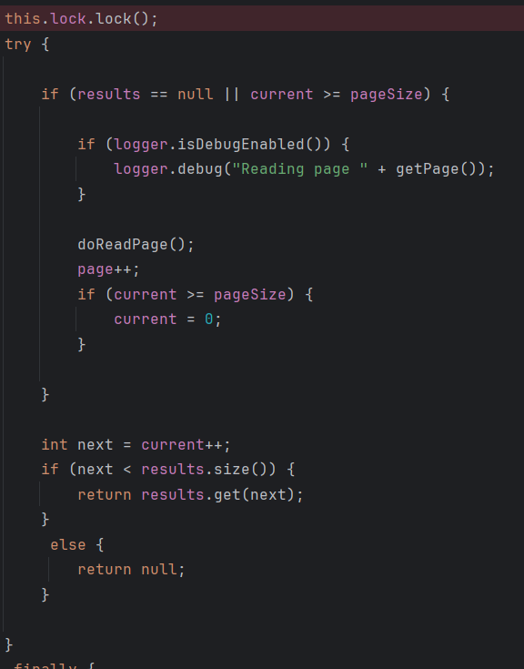

### Jdbc Paging Item Reader

* 페이지마다 새로운 쿼리를 실행하기 때문에 페이징 시 순서 보장을 위해 order by
* 멀티 스레드 환경에서 Thread 안정성 보장 **참고** JdbcCursorReader는 보장 안했다.



* API
```markdown
name
pageSize(int pageSize) -> 페이지 크기 설정
dataSource(Datasource)
queryProvider(PagingQueryProvider) -> 페이징 전략에 따른 provider
rowMapper(Class<T>) -> 쿼리 결과 데이터와 객체 매핑
selectClause -> select 절
whereClause -> where 절
groupClause -> group 절
sortKeys -> 정렬을 위한 유니크 키
parameterValues -> 쿼리 파라미터
maxItemCount -> 조회 최대 수
currentItemCount -> 조회 시작 지점
maxRows


```